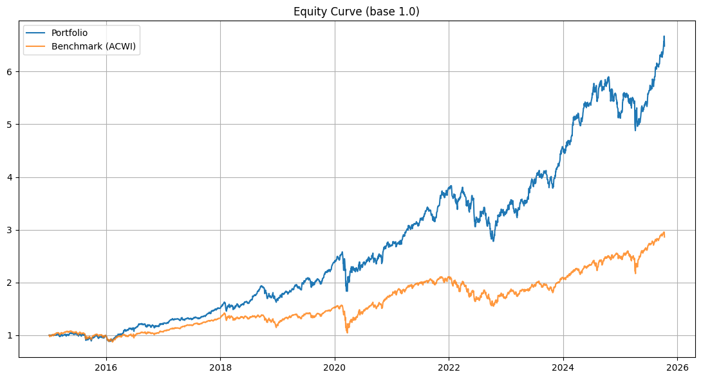

# 📈 Long-Only Momentum & Composite Strategy

Questo repository contiene il codice Python per una **strategia quantitativa long-only** progettata per ottenere rendimenti corretti per il rischio superiori alla media, combinando:

- **ITSM (Inverse Tangent Signal Model)**  
- **Composite Technical Score**  
- **Volatility Targeting**

La strategia mantiene un portafoglio **completamente investito (long-only)** sull’universo azionario selezionato.

---

## ⚙️ Strategy Highlights

- **Core Logic:** selezione di titoli basata su uno **score composito**:
  - 40% ITSM/Momentum  
  - 40% Composite Score  
  - 20% Gap Quality Factor  
- **Risk Management:** utilizzo del **Volatility Targeting** per mantenere una volatilità annualizzata target del **15% (Target Vol = 0.15)**  
- **Regime Filter:** filtro **Risk-On/Risk-Off** basato sulla **EMA a lungo termine** del benchmark (riduce l’esposizione nei periodi “Risk-Off”)  
- **Rebalancing:** ribilanciamento **settimanale (ogni Venerdì)**  

---

## 📊 Performance Summary (2015-01-01 → 2025-10-10)

I risultati del backtest mostrano una **netta sovraperformance** rispetto al benchmark globale (MSCI ACWI).

| **Metric** | **Portfolio** | **Relative to ACWI** | **Benchmark (ACWI)** |
| :--- | :--- | :--- | :--- |
| **CAGR (Annualized Return)** | **18.45%** | +7.69% | ~10.76% |
| **Sharpe Ratio** | **1.06** | +0.12 | ~0.94 |
| **Annualized Volatility** | 17.40% | — | (più alta) |
| **Max Drawdown (MaxDD)** | -28.95% | -18.14% | (più alto) |
| **Total Return** | **548.25%** | — | (inferiore) |

---

### 📈 Equity Curve & Relative Performance

Il grafico seguente mostra l’evoluzione dell’equity del portafoglio rispetto al benchmark, evidenziando la **consistenza della sovraperformance** e la **rapidità di recupero** dopo le fasi di drawdown.

---

## 🧮 Strategy Mechanics — Key Calculations

Il peso finale di ciascun titolo (`w_t`) è ottenuto in più fasi:  
**signal generation → score blending → regime filtering → volatility scaling**

---

### 1️⃣ Composite Score (da 0 a 6)

Il **Composite Score** (`Comp`) combina sei indicatori tecnici principali:  
ROC, EMA, MACD, RSI, MFI, e OBV.

Comp_Score = Signal_ROC + Signal_EMA + Signal_MACD + Signal_RSI + Signal_MFI + Signal_OBV

> Il punteggio è filtrato da una soglia `ATRP_MAX` e confrontato con la **Relative Strength (RS)** rispetto al benchmark prima di entrare nel blend finale.

---

### 2️⃣ Final Continuous Score

Il punteggio continuo finale (`Score_Cont`) è una **media ponderata** di tre componenti:

Score_Cont = (0.4 * Blend) + (0.4 * Comp_Norm) + (0.2 * Gap_Factor)

---

### 3️⃣ Volatility Targeting & Exposure

La strategia scala i pesi per mantenere una **volatilità annualizzata costante** di circa **15%**.

Lo **Scaling Factor (`Scale`)** dipende dalla volatilità realizzata del portafoglio (`RV`):

Scale = min(1.0, max(0.5, TARGET_VOL / RV))

Il peso finale è calcolato come:

w_final = w_raw * Scale * Expo

> Dopo la scalatura, i pesi vengono normalizzati a una **gross exposure del 100%**, con un **limite massimo per titolo** (`MAX_WEIGHT = 20%`).

---

## 🔄 Example — Rebalancing Trade List

Esempio di operazioni necessarie per passare da un portafoglio **Equal Weight (06-10-2025)** ai nuovi pesi target **(10-10-2025)**:

| **Ticker** | **Old Weight** | **New Weight** | **Action** |
| :--- | :--- | :--- | :--- |
| **LLY** | 6.67% | **14.07%** | **BUY ↑** |
| **MSFT** | 6.67% | **12.79%** | **BUY ↑** |
| **PFE** | 6.67% | **11.51%** | **BUY ↑** |
| **AMD** | 6.67% | **9.97%** | **BUY ↑** |
| **UNH** | 6.67% | **9.97%** | **BUY ↑** |
| ENEL.MI | 6.67% | 8.70% | REDUCE ↓ |
| LMT | 6.67% | 8.70% | BUY ↑ |
| DUK | 6.67% | 7.67% | BUY ↑ |
| CAT | 6.67% | 7.42% | BUY ↑ |
| BCS | 6.67% | 2.30% | REDUCE ↓ |
| NEM | 6.67% | 2.30% | REDUCE ↓ |
| QCOM | 6.67% | 2.30% | REDUCE ↓ |
| UBS | 6.67% | 2.30% | REDUCE ↓ |
| ADBE | 6.67% | **0.00%** | **SELL** |
| SHW | 6.67% | **0.00%** | **SELL** |

